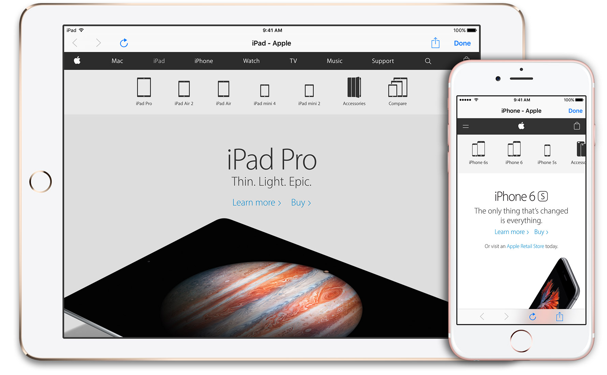

# TOWebViewController
### An In-line Web Browser for iOS Apps



[](http://api.travis-ci.org/TimOliver/TOWebViewController.svg)
[](http://cocoadocs.org/docsets/TOWebViewController)
[](http://cocoadocs.org/docsets/TOWebViewController)
[](http://cocoadocs.org/docsets/TOWebViewController)

`TOWebViewController` is an open-source `UIViewController` subclass designed to let apps quickly present web page content to its users, without needing to kick them over to Safari. `TOWebViewController` has been designed from the ground up to be easily integrated into existing projects, to take advantage of the latest features of iOS, and to optionally be backwards compatible with (significantly) earlier versions of iOS.

## Features
* Backwards compatible down to iOS 5.
* Full navigation buttons set, including back, forward, refresh and an optional share/action button.
* Detects whether being pushed modally via `[UIViewController presentViewController]` or being pushed onto a `UINavigationController` stack and adjusts the UI accordingly.
* A page load progress bar  (using [ninjinkun's amazing algorithm](https://github.com/ninjinkun/NJKWebViewProgress) )
* Plays a smooth, elegant rotation animation if/when the user rotates the device
* Icons are procedurally generated by CoreGraphics (ie, no unnecessary image assets at all!)
* Compatible with iOS 8 size classes, including split-screen on iPad Air 2, iPad mini 4 and iPad Pro
* (TODO) Re-implement the popup that appears when users tap and hold a link for added flexibility.  
* (TODO) An optional text field for which users may manually enter in a URL
* (TODO) A proper delegate system to allow external classes to interact with this controller.
* (TODO) A rudimentary bookmark system.

## Example
```objc
TOWebViewController *webViewController = [[TOWebViewController alloc] initWithURL:[NSURL URLWithString:@"http://www.apple.com/"];
[self presentViewController:[[UINavigationController alloc] initWithRootViewController:webViewController] animated:YES completion:nil];
```

## System Requirements
iOS 5.0 or above

## Installation

### [Cocoapods](https://cocoapods.org/)

``` ruby
pod 'TOWebViewController'
```

### Manual

Download this project from GitHub, move the subfolder named 'TOWebViewController' over to your project folder, and drag it into your Xcode project.

After that, you'll need to link the following system frameworks to your project:
* QuartzCore.framework
* CoreGraphics.framework
* MessageUI.framework
* Twitter.framework

## License

TOWebViewController is licensed under the MIT License. For more information, please see the [LICENSE](LICENSE) file.
