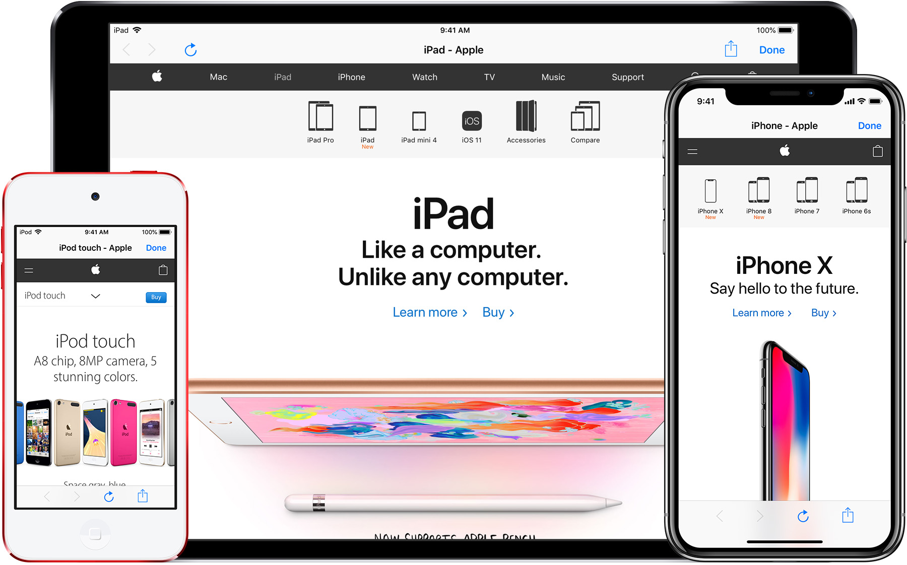

# TOWebViewController
### An Inline Web Browser for iOS Apps



[](http://api.travis-ci.org/TimOliver/TOWebViewController.svg)
[](https://cocoapods.org/pods/TOWebViewController)
[](http://cocoadocs.org/docsets/TOWebViewController)
[](https://github.com/Carthage/Carthage)
[](https://raw.githubusercontent.com/TimOliver/TOWebViewController/master/LICENSE)
[](http://cocoadocs.org/docsets/TOWebViewController)
[](https://beerpay.io/TimOliver/TOWebViewController)
[](https://www.paypal.com/cgi-bin/webscr?cmd=_s-xclick&hosted_button_id=M4RKULAVKV7K8)
[](http://twitch.tv/timXD)


`TOWebViewController` is an open-source `UIViewController` subclass designed to let apps quickly present web page content to its users, without needing to kick them over to Safari. `TOWebViewController` has been designed from the ground up to be easily integrated into existing projects, to take advantage of the latest features of iOS, and to optionally be backwards compatible with (significantly) earlier versions of iOS.

## Features
* Powered by `UIWebView`, backwards compatible down to iOS 5.
* Full navigation buttons set, including back, forward, refresh and an optional share/action button.
* Detects whether being pushed modally, or via a navigation controller and adjusts the UI accordingly.
* A page load progress bar  (using [ninjinkun's amazing algorithm](https://github.com/ninjinkun/NJKWebViewProgress)).
* Plays a smooth, elegant rotation animation if/when the user rotates the device.
* Icons are procedurally generated by CoreGraphics (ie, no unnecessary image assets at all!).
* Compatible with iOS 8 size classes, including split-screen on iPad Air 2, iPad mini 4 and iPad Pro.
* 1Password automatic password input extension support.
* **(TODO)** A proper delegate system to allow external classes to interact with this controller.
* **(TODO)** Basic navigation history that displays when long-pressing the back/forward buttons.
* **(TODO)** A proper 'Error Occurred/Not connected to the internet' dialog view.

## Example
`TOWebViewController` is smart enough to be able to tell when it's being presented as a modal popup, and when it's being pushed onto a `UINavigationController` and to change its button layout accordingly. 

### Presenting as a Modal Dialog

When presenting as a modal popup, it is still necessary to create a parent `UINavigationController` in order for the buttons to display properly:

```objc
TOWebViewController *webViewController = [[TOWebViewController alloc] initWithURL:[NSURL URLWithString:@"http://www.apple.com/"]];
UINavigationController *navigationController = [[UINavigationController alloc] initWithRootViewController:webViewController];
[self presentViewController:navigationController animated:YES completion:nil];
```

### Pushing onto a `UINavigationController`
```objc
TOWebViewController *webViewController = [[TOWebViewController alloc] initWithURL:[NSURL URLWithString:@"http://www.apple.com/"]];
[self.navigationController pushViewController:webViewController animated:YES];
```

## System Requirements
iOS 5.0 or above

## Installation

#### As a CocoaPods Dependency

Add the following to your Podfile:
``` ruby
pod 'TOWebViewController'
```

#### As a Carthage Dependency

Add the following to your Cartfile:
``` 
github "https://github.com/TimOliver/TOWebViewController"
```

#### Manual Installation

Download this project from GitHub, move the subfolder named 'TOWebViewController' over to your project folder, and drag it into your Xcode project.

After that, you'll need to link the following system frameworks to your project:
* QuartzCore.framework
* CoreGraphics.framework
* MessageUI.framework
* Twitter.framework

## Why no `WKWebView` adoption?
While `WKWebView` does look much nicer than `UIWebView`, it has several show-stopping issues. Most importantly, session and cookie data that is created inside a `WKWebView` isn't accessible by the rest of the Foundation framework. Since a large goal in building this project was to allow users to log into web accounts and subsequently use that session to download files, this is simply unacceptable.

`TOWebViewController` will not be adopting `WKWebView` at any point in the future. If you would like an alternative view controller that does, please give [DZNWebViewController](https://github.com/dzenbot/DZNWebViewController) a try!

## What about `SFSafariViewController`?
Starting from iOS 9, Apple now provides a built-in web view controller of similar functionality named [`SFSafariViewController`](https://developer.apple.com/library/ios/documentation/SafariServices/Reference/SFSafariViewController_Ref/). If your app is only targeting iOS 9, and it completely fills your requirements, then it is absolutely recommended that you adopt `SFSafariViewController` instead of `TOWebViewController`.

That being said, if you are still targeting lower iOS versions, or require more customisability than `SFSafariViewController` provides, then `TOWebViewController` can still serve as a viable alternative.

## Credits
`TOWebViewController` was originally created by [Tim Oliver](http://twitter.com/TimOliverAU) as a component for [iComics](http://icomics.co), a comic reader app for iOS.

Thanks also goes to `TOWebViewController`'s growing list of [contributors](https://github.com/TimOliver/TOWebViewController/graphs/contributors)!

iPad Air 2 and iPhone 6s Plus device mockups by [Pixeden](http://www.pixeden.com).

## License

TOWebViewController is licensed under the MIT License. For more information, please see the [LICENSE](LICENSE) file. 
